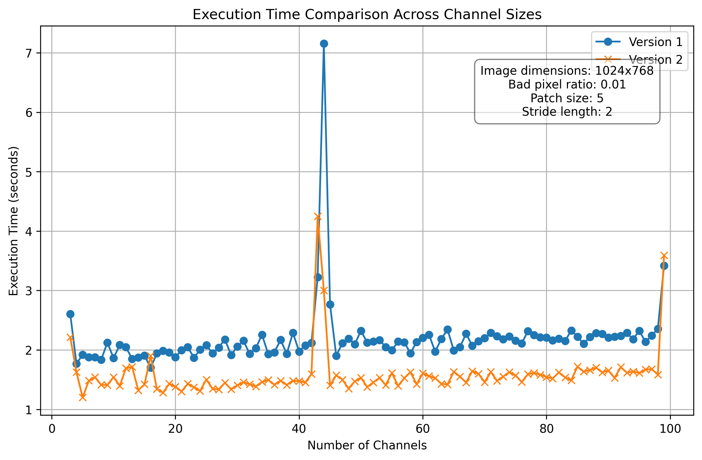

# Programming_Exercise
A short programming exercise for a startup company’s take-home challenge.

# Image Patch Extraction Toolkit

## Overview
The Image Patch Extraction Toolkit provides a set of tools for extracting patches from images and their corresponding masks, useful for tasks in computer vision and image processing

## Features
- Extract patches from images with specified patch size and stride length.
- Exclude patches containing specific values (e.g., `-1` indicating missing data).
- Vectorized operations for efficient patch extraction from large datasets.
- Support for both image data and mask data, facilitating machine learning tasks that require corresponding image and mask patches.

### Prerequisites
- Python 3.6+
- NumPy


## Usage

### Extracting Patches
To extract patches from an image and its corresponding mask:

```python
import numpy as np
from dataset_extract import inputs_to_dataset_v1, inputs_to_dataset_v2

# Example image and mask
image = np.array([...], dtype=np.float32)  # Your image data here
mask = np.array([...], dtype=np.uint8)     # Your mask data here

patch_size = 2  # Size of the patches
stride_length = 1  # Stride length for patch extraction

# Version 1: Direct patch extraction
image_patches_v1, mask_patches_v1 = inputs_to_dataset_v1(image, mask, patch_size, stride_length)

# Version 2: Extracting patches using valid start positions
image_patches_v2, mask_patches_v2 = inputs_to_dataset_v2(image, mask, patch_size, stride_length)
```
### Function Reference
- inputs_to_dataset_v1(image, mask, patch_size, stride_length): Extracts all patches from an image and its corresponding mask, filtering out any patches that contain -1.

- inputs_to_dataset_v2(image, mask, patch_size, stride_length): Identifies valid starting positions for patches by analyzing all channels, then efficiently extracts these patches, optimizing overall performance.


#### Choosing Between v1 and v2
Use inputs_to_dataset_v1 if your dataset is relatively small or if the density of invalid data (-1 values) is high across the image, necessitating individual checks on each patch.

The inputs_to_dataset_v2 function is particularly advantageous for economic company analysis involving high-dimensional data, due to its:

- Optimized Performance for High-Dimensional Data: Tailored to efficiently process datasets with a large number of channels, reducing computational overhead significantly.

- Reduced Redundancy in Data Processing: By pre-identifying valid patches, it minimizes unnecessary computations, enhancing processing efficiency.

- Improved Resource Utilization: Its efficient data handling leads to better computational resource use, crucial for companies aiming to economize on data processing costs.

# Performance Comparison between Version 1 and Version 2

## Execution Time Comparison

The plot below shows the execution time for both versions across a range of channel sizes. As illustrated, `inputs_to_dataset_v2` consistently outperforms `inputs_to_dataset_v1`, highlighting its suitability for economic company analysis data with high channel numbers.



The results demonstrate the superior efficiency of `inputs_to_dataset_v2`, making it a favorable choice for processing complex, high-dimensional datasets.

## Contact

For any inquiries or further discussions regarding this project, feel free to reach out:

- **Email**: [tina.cos.ge@gmail.com](mailto:tina.cos.ge@gmail.com)
